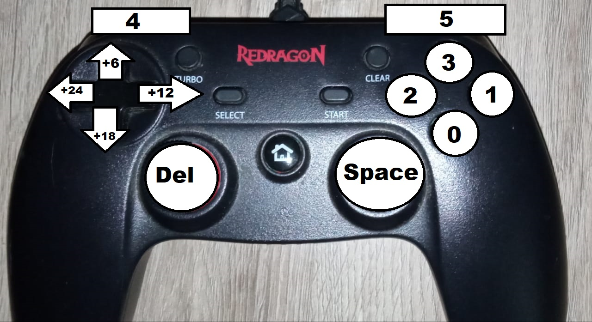
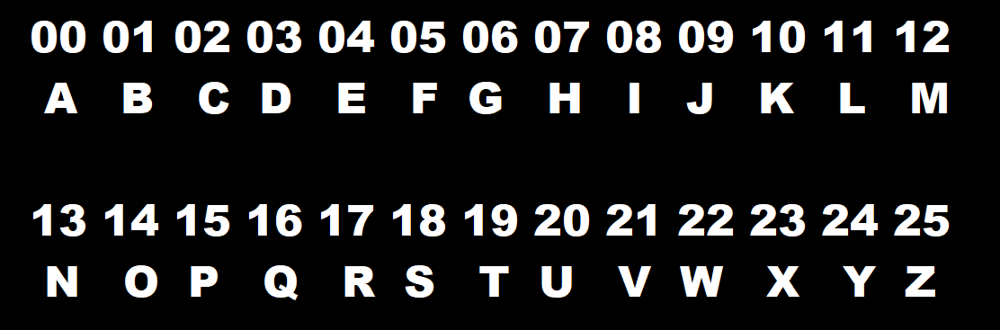

This is a python script that uses the pygame module to read the inputs of a joystick and write with it a text file. It maps the buttons to letters of the keyboard.

The four buttons on the right and the right and left buttons has numerical values. Those numerical values are map to a letter of the alphabeth.

R3 is used for a blank space and L3 is used to delete a letter.

When an arrow button is pressed this add a numerical value to the values mapped to the rigth hand side buttons.

So in order to write "hello world" with you need to press this sequence. 

Arrow_Up + Button 1 = H

Button 4 = E

Arrow_Up +  Button 5 = L

Arrow_Up +  Button 5 = L

Arrow_Right + Button 2 = O

R3 = space

Arrow_Down + Button 4 = W

Arrow_Right + Button 2 = O

Arrow_Right + Button 5 = R

Arrow_Up +  Button 5 = L

Button 3 = D

